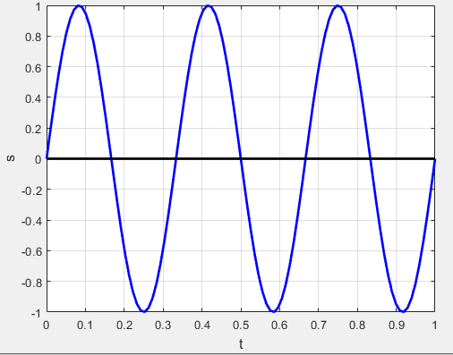
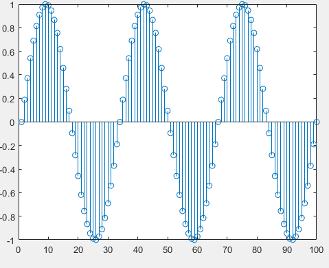

# Generating Continuous and Discrete Signals in MATLAB
This document provides a basic method to generating signals in MATLAB, showcasing both continuous and discrete representations.

## Continuous Signal
A continuous signal varies continuously with time. Here's how to generate a continuous sinusoidal signal in MATLAB:

### Time Vector
Define a time vector t using the linspace function. This creates a sequence of evenly spaced points between a start and end time. In this example:

```
Matlab
t = linspace(0, 1, 100);  % 100 points from 0 to 1 second
```
### Signal Generation
Define the signal equation. Here, we use sin to create a sine wave with specific frequency and amplitude:

```
Matlab
s = sin(2*pi*3*t);  % Sine wave with frequency 3 Hz
```

### Plotting
Use the plot function to visualize the continuous signal.


## Discrete Signal

A discrete signal consists of separate values at specific points in time. Here's how to convert the continuous signal to a discrete representation:

### Visualization:
 - Stem Plot: Use the stem function to visualize the discrete data points. 
```
Matlab
s = sin(2*pi*3*t);  % Sine wave with frequency 3 Hz
stem(s);
```

