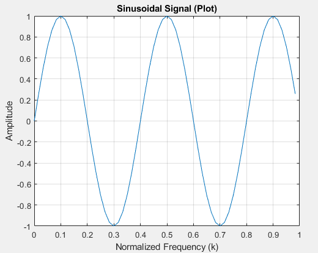

# Method 2: Generating a Sinusoid signal
This method demonstrates how to generate a sinusoidal signal in MATLAB, considering three parameters.

## Parameters
- fs: Sampling frequency (in Hz). This defines how often the signal is sampled to obtain discrete data points.
  
- N: Number of periods of the sine wave to be included within the generated signal.
  
- L: Signal duration (in seconds). This is calculated based on the sampling frequency and the desired number of data points.

## Data Visualization
There are two ways to visualize the generated signal

```
Matlab
% Define parameters
fs = 10; 
N = 2.5; 
L = 60/fs;  

% Generate time vector (normalized frequency)
k = 0:1/fs:L-1/fs;
k = k/L;  

% Generate the sinusoidal signal
s = sin(2*pi*N*k);
```
- Using plot: This displays a continuous line representing the overall trend of the sine wave.
  


- Using stem: This emphasizes individual data points with vertical lines and markers, showing the discrete nature of the signal.


