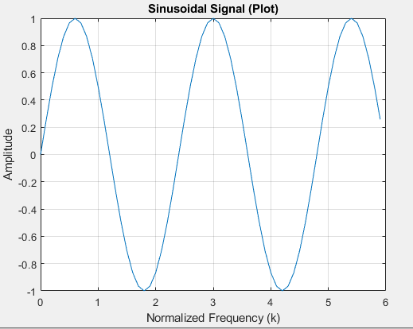
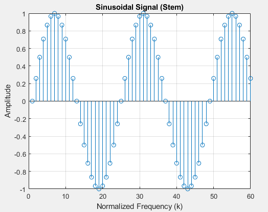

# Method 4: Generating a Sinusoid signal
Generating a signal consisting of n data points sampled at fs sampling rate with the frequency f

## Parameters

n: Number of data points (specifies the resolution of the signal).

f: Desired frequency of the sine wave (in Hz). This directly controls the number of cycles per second in the generated signal.

fs: Sampling frequency (in Hz). This defines how often the signal is sampled to obtain discrete data points.


## Data Visualization
There are two ways to visualize the generated signal

```
Matlab
% Define parameters
n = 60; 
f = 5;  
fs = 10;  

% Generate time vector (seconds)
k = 0:n-1;
k = k * (1/fs); 

% Generate the sinusoidal signal
s = sin(2*pi*f*k);
```
- Using plot: This displays a continuous line representing the overall trend of the sine wave.
  


- Using stem: This emphasizes individual data points with vertical lines and markers, showing the discrete nature of the signal.


