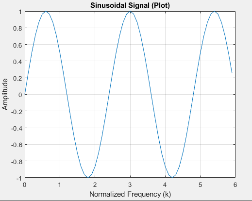
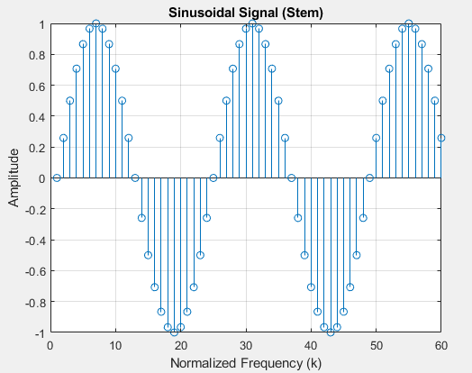

# Method 3: Generating a Sinusoid signal
Generating a sinusoid signal sampled at fs sampling rate with N periods in it with the frequency f

## Parameters:

f: Desired frequency of the sine wave (in Hz). This directly controls the number of cycles per second in the generated signal.

N: Number of periods of the sine wave you want to represent within the generated signal. 

fs: Sampling frequency (in Hz). This defines how often the signal is sampled to obtain discrete data points.


## Data Visualization
There are two ways to visualize the generated signal

```
Matlab
% Define parameters
f = 5;    
N = 2.5;   
fs = 10; 

% Generate time vector (normalized frequency) based on actual frequency
k = 0:1/fs:(N/f)-1/fs; 

% Generate the sinusoidal signal
s = sin(2*pi*f*k);
```

- Using plot: This displays a continuous line representing the overall trend of the sine wave.
  


- Using stem: This emphasizes individual data points with vertical lines and markers, showing the discrete nature of the signal.


